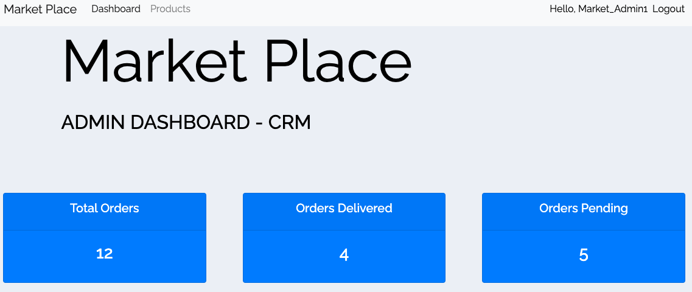

# MarketPlace


<br>
<hr>

## Table of contents
  * [Overview](#overview)
  * [Project Goal](#project-goal)
  * [UX/UI](#uxui)
    + [Strategy](#strategy)
    + [Design](#design)
    + [Structure](#structure)
  * [Agile](#agile)
    + [Agile Overview](#agile-overview)
    + [User Stories](#user-stories)
  * [Features](#features)
    + [Existing Features](#existing-features)
    + [Future Feature Considerations](#future-feature-considerations)
  * [Responsive Layout and Design](#responsive-layout-and-design)
  * [Tools Used](#tools-used)
    + [Python packages](#python-packages)
  * [Testing](#testing)
  * [Deployment](#deployment)
    + [Deploy on heroku](#deploy-on-heroku)
  * [Credits](#credits)
    + [Content](#content)
    + [Media](#media)
    + [Code](#code)
  * [Acknowledgements](#acknowledgements)

## Overview
MarketPlace is a Django-based web application designed as a Customer Relationship Management (CRM) system for the food industry. It allows customers to place orders and business owners to manage these orders, update delivery statuses, and handle products.

MarketPlace streamlines the order and customer management process for businesses in the food industry by providing an online portal where customers can place orders and business owners can manage them. The application is designed to simplify operations and improve the efficiency of food service businesses.

## Project Goal

The primary goal is to provide a seamless and efficient platform for businesses in the food industry to manage their customer orders and streamline their operations. By offering an online portal, the application aims to simplify the order and customer management process, ultimately benefiting both the businesses and their customers.

For businesses, MarketPlace offers the following key advantages:

1. **Centralized Order Management**: Business owners and administrators can easily create, view, update, and delete products available for ordering. They can also track and update the status of customer orders, ensuring efficient order fulfillment and delivery.

2. **Customer Relationship Management**: The application provides a centralized platform for managing customer information, order history, and analytics. This enables businesses to better understand their customer base, identify trends, and make data-driven decisions to improve customer satisfaction and loyalty.

3. **Operational Efficiency**: By automating and digitizing the order management process, MarketPlace helps businesses reduce manual efforts, minimize errors, and optimize their operational workflows, ultimately leading to cost savings and increased productivity.

For customers, the application offers the following benefits:

1. **Convenient Ordering**: Customers can easily browse and place orders for their desired products from the comfort of their devices, eliminating the need for traditional phone or in-person ordering methods.

2. **Order Tracking**: Customers can track the status of their orders in real-time, providing transparency and peace of mind throughout the order fulfillment process.

3. **Account Management**: Customers can create and manage their accounts, update personal information, and access their order history, fostering a personalized and seamless user experience.

Overall, MarketPlace aims to bridge the gap between food businesses and their customers by leveraging technology to enhance communication, streamline processes, and deliver a superior user experience for all stakeholders involved.

## UX/UI

### Strategy

The goal of MarketPlace is to provide a seamless and efficient user experience for both customers and business owners in the food industry. The strategy behind the UX/UI design focuses on creating an intuitive and user-friendly interface that streamlines the order management process.

For customers, the application aims to offer a convenient and hassle-free ordering experience. The user interface is designed to be clean and straightforward, allowing customers to easily browse available products, place orders, and track their order status.

For business owners and admins, the application prioritizes efficient order management and product administration. The UI is designed to provide a clear overview of orders, customer information, and product details, enabling quick decision-making and streamlined operations.

### Design

The design follows modern web design principles and best practices. The user interface is built using responsive design techniques, ensuring a consistent and optimized experience across various devices and screen sizes.

The color scheme and typography are carefully chosen to create a visually appealing and cohesive design language. The use of Bootstrap 4 as the CSS framework ensures a consistent and responsive layout, while Font Awesome icons enhance the visual appeal and usability of the application.

The application adheres to accessibility guidelines, ensuring that users with disabilities can effectively navigate and interact with the platform. This includes considerations for color contrast, keyboard navigation, and screen reader compatibility.

### Structure

Following a logical and intuitive information architecture, making it easy for users to navigate and find the desired functionality.

The application is divided into two main sections: the customer area and the admin area. Each section is tailored to the specific needs and responsibilities of its respective user group.

1. **Customer Area**:
   - Registration and login
   - Product browsing and ordering
   - Order tracking and management
   - Account settings and order history

2. **Admin Area**:
   - Product management (create, view, edit, delete)
   - Order management (view, update status, delete)
   - Customer management (view customer details and order history)
   - Analytics and reporting

The navigation menu is designed to be clear and consistent, providing easy access to the relevant sections and features based on the user's role and permissions.

Overall, the UX/UI prioritises usability, accessibility, and a seamless user experience, ensuring that both customers and business owners can efficiently manage their orders and operations.

## Agile

### Agile Overview

Agile principles and practices are embraced throughout the project to ensure efficient collaboration, iterative development, and continuous delivery of value to stakeholders.

The development process is organised into sprints, which are short, time-boxed iterations lasting two weeks. During each sprint, the focus is on delivering a set of prioritised features or user stories, ensuring that the most valuable work is completed first.

- **Sprint Planning**: At the beginning of each sprint, the product backlog is reviewed, user stories get prioritised and the scope of work for the upcoming sprint is evaluated.

- **Daily Stand-ups**: While traditionally a team conducts daily stand-up meetings to synchronise their work, identify any blockers, and ensure progress is being made towards the sprint goals. In this case as a solo developer, this time was used to review code, identify any issues and research solutions and check in on progress against user stories and bugs.

- **Sprint Review**: At the end of each sprint, a sprint review is carried out to review the completed work to stakeholders and gather feedback. In this case against MVP set out at the outset of the project. 

- **Sprint Retrospective**: Following the sprint review, all work is retrospectively reviewed to reflect on the past sprint, identify areas for improvement, and plan for the next iteration.

The project utilises GitHub Projects as the primary tool for managing the product backlog, tracking user stories, and visualising the workflow. The project board provides a clear overview of the work todo, in progress, completed.

### User Stories

The development of the MarketPlace is driven by user stories, which represent the desired functionality from the perspective of different user roles. User stories are prioritised based on business value and customer needs, ensuring that the most critical features are delivered first.

The initial set of user stories where not sufficient to encapsulate the whole project. Below is a full list of User Stories for the MarketPlace, along with their updated acceptance criteria:


### Customer

1. **Registration and Login**
   - As a customer, I want to be able to register for an account on the MarketPlace platform and log in securely.

   Acceptance Criteria:
   - User can create a new account by providing a username, email, and password.
   - User can log in to their account using their username (or email) and password.
   - User is redirected to the appropriate page after successful login or registration.

2. **Order Management**
   - As a customer, I want to be able to view all the products available for ordering.
   - As a customer, I want to be able to place a new order for one or more products.
   - As a customer, I want to be able to view the status of my orders (pending, out for delivery, delivered).
   - As a customer, I want to be able to edit or cancel an existing order.

   Acceptance Criteria:
   - User can view a list of all available products with details like name, price, and category.
   - User can add one or more products to their order and submit the order.
   - User can view the current status of their orders (pending, out for delivery, delivered).
   - User can modify or cancel an existing order before it is marked as delivered.

3. **Account Settings**
   - As a customer, I want to be able to update my account information (name, phone, email).
   - As a customer, I want to be able to view my order history.

   Acceptance Criteria:
   - User can update their account information, including name, phone number, and email address.
   - User can view a list of their past orders, including order details and status.

### Admin/Business Owner

1. **Product Management**
   - As an admin, I want to be able to create a new product with details such as name, price, category, and description.
   - As an admin, I want to be able to view a list of all available products.
   - As an admin, I want to be able to edit the details of an existing product.
   - As an admin, I want to be able to delete a product from the store.

   Acceptance Criteria:
   - Admin can create a new product by providing details like name, price, category, and description.
   - Admin can view a list of all existing products with their details.
   - Admin can modify the details of an existing product, such as name, price, category, and description.
   - Admin can remove a product from the store, making it unavailable for ordering.

2. **Order Management**
   - As an admin, I want to be able to view all orders placed by customers.
   - As an admin, I want to be able to view the details of a specific order, including the customer information and ordered products.
   - As an admin, I want to be able to update the status of an order (pending, out for delivery, delivered).
   - As an admin, I want to be able to delete an order.

   Acceptance Criteria:
   - Admin can view a list of all orders placed by customers, including order details and customer information.
   - Admin can view the details of a specific order, such as customer information, ordered products, and order status.
   - Admin can update the status of an order to reflect its current state (pending, out for delivery, delivered).
   - Admin can remove an order from the system if necessary.

3. **Customer Management**
   - As an admin, I want to be able to view a list of all registered customers.
   - As an admin, I want to be able to view the details of a specific customer, including their order history.

   Acceptance Criteria:
   - Admin can view a list of all registered customers on the platform.
   - Admin can view the details of a specific customer, including their order history and account information.

4. **Analytics and Reporting**
   - As an admin, I want to be able to view various analytics and reports, such as total orders, total customers, orders by status, and revenue generated.

   Acceptance Criteria:
   - Admin can view various analytics and reports related to orders, customers, and revenue.
   - Analytics and reports provide insights into key metrics like total orders, total customers, orders by status, and revenue generated.

<br>
These user stories serve as the foundation for the development process, ensuring that the application meets the needs and expectations of both customers and business owners. The acceptance criteria provide a clear definition of when a user story is considered complete, facilitating effective testing and validation.

By following an Agile approach and prioritising user stories based on business value, the MarketPlace application can adapt to changing requirements, incorporate feedback from stakeholders, and continuously deliver value throughout the development lifecycle.

## Features

### Existing Features

Offering a comprehensive set of features to streamline the order management process for businesses in the food industry and provide a convenient ordering experience for customers. It is designed that it can also be added into an already existing project in order to manage sales digitally. 

#### Customer Features

1. **User Registration and Authentication**
   - Customers can create a new account by providing a username, email, and password.
   - Existing users can securely log in to their accounts using their credentials.
   - User authentication is handled by Django Allauth, ensuring secure access to the application.

2. **Product Browsing and Ordering**
   - Customers can view a list of all available products, including details such as name, price, category, and description.
   - Products are categorised for easy browsing and navigation.
   - Customers can add one or more products to their cart and place an order.

3. **Order Tracking**
   - Customers can view the status of their orders, which can be pending, out for delivery, or delivered.
   - Order tracking provides transparency and keeps customers informed about the progress of their orders.

4. **Account Management**
   - Customers can update their account information, including name, phone number, and email address.
   - They can also view their order history, allowing them to track past orders and their details.

#### Admin/Business Owner Features

1. **Product Management**
   - Admins can create new products by providing details such as name, price, category, and description.
   - They can view a list of all existing products and their details.
   - Admins have the ability to edit or delete products as needed.

2. **Order Management**
   - Admins can view a list of all orders placed by customers, including order details and customer information.
   - They can view the details of a specific order, such as customer information, ordered products, and order status.
   - Admins can update the status of an order to reflect its current state (pending, out for delivery, delivered).
   - They also have the ability to delete orders if necessary.

3. **Customer Management**
   - Admins can view a list of all registered customers on the platform.
   - They can access the details of a specific customer, including their order history and account information.

4. **Analytics and Reporting**
   - Admins have access to various analytics and reports related to orders, customers, and revenue.
   - These reports provide insights into key metrics such as total orders, total customers, orders by status, and revenue generated.

The existing features cater to the needs of both customers and business owners, offering a comprehensive solution for order management, product administration, and customer relationship management.

### Future Feature Considerations

While the current version of the application provides a solid foundation, there are several potential features that could be considered for future development to enhance the user experience and functionality:

1. **Product Images**
   - Allow business owners/admins to upload and associate images with their products, providing visual representation and improving the browsing experience for customers.

2. **User Profiles**
   - Enable users to create and manage their profiles, including the ability to upload profile pictures and additional personal information.

3. **Payment Integration**
   - Integrate with a payment gateway or service (e.g., Stripe) to enable secure online payments for orders, streamlining the checkout process for customers.

4. **Shipping Integration**
   - Integrate with shipping providers or services to calculate shipping costs and generate shipping labels, enhancing the order fulfillment process.

5. **Email Notifications**
   - Implement email notifications for order updates, delivery confirmations, and other important events, keeping customers informed throughout the order lifecycle.

6. **Search and Filtering**
   - Implement search and filtering functionality to allow customers to easily find specific products based on keywords, categories, or other criteria.

7. **Reviews and Ratings**
   - Enable customers to leave reviews and ratings for products they have purchased, providing valuable feedback for other customers and businesses.

8. **Inventory Management**
   - Introduce inventory management capabilities, allowing business owners to track stock levels, receive low-stock alerts, and manage product availability.

9. **Mobile Responsiveness**
   - Enhance the application's mobile responsiveness to provide an optimal user experience across various devices, including smartphones and tablets.

10. **Multi-language Support**
    - Implement multi-language support to cater to a broader audience and expand the application's reach.

11. **Analytics and Reporting**
    - Implement further financial tools to assist in the management of sales, insights into profit and loss.

These future feature considerations are based on common industry practices and user expectations, aiming to enhance the overall user experience, improve functionality, and provide additional value to both customers and business owners.


## Responsive Layout and Design

A mobile-first approach and leverages the power of Bootstrap 4 to ensure a responsive and consistent user experience across various devices and screen sizes.

### Mobile-First Design

The application's design and development process adheres to the mobile-first principle, which prioritises the mobile experience from the outset. This approach ensures that the application is optimised for smaller screens and touch-based interactions, providing a seamless experience for users on mobile devices.

By starting with a mobile-first mindset, the application's layout, navigation, and user interface elements are carefully crafted to work seamlessly on smaller screens. This includes considerations such as:

- Optimized font sizes and touch targets for easy interaction on mobile devices.
- Responsive navigation menus that adapt to different screen sizes.
- Efficient use of screen real estate to display essential information without cluttering the interface.
- Prioritization of content and functionality based on mobile usage patterns.


### Bootstrap 4 Integration

Utilising Bootstrap 4, a popular and powerful front-end framework, to achieve responsive design and consistent styling across different devices and browsers.

Bootstrap 4 provides a comprehensive set of responsive utilities, grid system, and pre-built components that simplify the process of creating responsive layouts and user interfaces. By leveraging Bootstrap's responsive classes and grid system, the application's layout adapts seamlessly to different screen sizes, ensuring an optimal viewing experience for users on desktops, tablets, and mobile devices.

Some key features of Bootstrap 4 utilised in the application include:

- **Responsive Grid System**: The application's layout is built using Bootstrap's responsive grid system, which automatically adjusts the layout based on the screen size and device orientation.
- **Responsive Utilities**: Bootstrap's responsive utilities, such as `d-none` and `d-block`, are used to show or hide specific elements based on the screen size, ensuring a clutter-free and optimized user interface.
- **Responsive Navigation**: The application's navigation menus are implemented using Bootstrap's responsive navigation components, such as the navbar and dropdown menus, which adapt their appearance and behavior based on the screen size.
- **Responsive Typography**: Bootstrap's typography classes are utilized to ensure that text sizes, line heights, and spacing are optimized for different screen sizes, improving readability and accessibility.

### Accessibility Considerations

In addition to responsive design, the app also prioritises accessibility to ensure that users with disabilities can effectively navigate and interact with the platform. This includes considerations such as:

- Proper use of semantic HTML elements for better screen reader accessibility.
- Appropriate color contrast ratios for text and background colors, ensuring readability for users with visual impairments.
- Keyboard navigation support, allowing users to navigate and interact with the application using only a keyboard.
- Alternative text (alt tags) for images, providing descriptive information for users who are visually impaired or have images disabled.

By following a mobile-first approach, leveraging Bootstrap 4's responsive capabilities, and adhering to accessibility guidelines, delivering a seamless and inclusive user experience across a wide range of devices.

## Tools Used

MarketPlace leverages a variety of tools and technologies to ensure efficient development, deployment, and maintenance. Here's an overview of the key tools used in the project:

### Python Packages

The application is built using the Python programming language and relies on several Python packages and libraries to provide various functionalities. These packages are listed in the `requirements.txt` file and can be installed using the following command:

```
pip install -r requirements.txt
```

Here are the main Python packages used in the project:

- **Django**: The core web framework used for building MarketPlace. Django provides a high-level Python web framework that encourages rapid development and clean, pragmatic design.

- **django-allauth**: A set of Django applications that handle account authentication, registration, management, and third-party (social) account authentication.

- **Pillow**: A Python Imaging Library (PIL) fork that adds image processing capabilities, which will be used for handling product images in future iterations of the application.

- **psycopg2-binary**: A PostgreSQL database adapter for Python, allowing the application to interact with the PostgreSQL database hosted on ElephantSQL.

- **gunicorn**: A Python WSGI HTTP Server for UNIX, used for deploying the application on Heroku.

- **whitenoise**: A Python package that serves static files efficiently for Django applications, ensuring optimal performance when serving static assets in production.

A full list of packages can be found in the requirements.txt file. 

In addition to these Python packages, the application also utilizes several built-in Django modules and libraries, such as:

- **Django Forms**: Used for creating and handling forms for user input, such as product creation, order management, and user registration.

- **Django Models**: Defines the data models and database schema for the application, including models for customers, products, orders, and tags.

- **Django Views**: Handles the logic for rendering templates and processing user requests, implementing the application's functionality.

- **Django Templates**: Provides a templating engine for generating dynamic HTML pages, allowing for the separation of presentation logic from the application code.

- **Django Authentication and Authorization**: Handles user authentication, permission management, and access control through built-in modules and decorators.

- **Django Admin**: Provides a built-in administrative interface for managing the application's data models, allowing administrators to easily view and modify data.

By leveraging these Python packages and Django's built-in modules ensures efficient development, maintainability, and scalability.


### Testing
testing can be found in [TESTING.MD](TESTING.md)

## Deployment

The MarketPlace application is designed to be deployed on the Heroku platform, a cloud-based hosting service that supports Python and Django applications. Heroku provides a seamless deployment process and a robust infrastructure for running web applications.

### Deploy on Heroku

To deploy the MarketPlace application on Heroku, follow these steps:

1. **Sign up for Heroku**
   - If you don't have a Heroku account, sign up at [https://www.heroku.com](https://www.heroku.com/)

2. **Install Heroku CLI**
   - Install the Heroku Command Line Interface (CLI) by following the instructions provided in the [Heroku Dev Center](https://devcenter.heroku.com/articles/heroku-cli).

3. **Create a Heroku App**
   - Open your terminal or command prompt and navigate to your project directory.
   - Run the following command to create a new Heroku app:
     ```
     heroku create your-app-name
     ```
     Replace `your-app-name` with a unique name for your application.

4. **Configure Environment Variables**
   - The MarketPlace application requires several environment variables to be set for proper configuration. These variables include database credentials, secret keys, and other sensitive information.
   - Run the following command to set an environment variable on Heroku:
     ```
     heroku config:set VARIABLE_NAME=value
     ```
     Replace `VARIABLE_NAME` with the name of the environment variable and `value` with the corresponding value.
   - Repeat this command for each required environment variable.

5. **Set up the Database**
   - The MarketPlace application uses a PostgreSQL database hosted on ElephantSQL.
   - Create a new instance on ElephantSQL or use an existing one.
   - Obtain the database URL from the ElephantSQL dashboard.
   - Set the `DATABASE_URL` environment variable on Heroku with the obtained URL:
     ```
     heroku config:set DATABASE_URL=your-database-url
     ```

6. **Configure Static Files**
   - The MarketPlace application uses WhiteNoise to serve static files efficiently in production.
   - Set the following environment variables on Heroku:
     ```
     heroku config:set DISABLE_COLLECTSTATIC=1
     ```

7. **Push the Code to Heroku**
   - Initialize a Git repository in your project directory (if not already done):
     ```
     git init
     ```
   - Add the Heroku remote to your Git repository:
     ```
     heroku git:remote -a your-app-name
     ```
   - Commit your changes:
     ```
     git add .
     git commit -m "Initial commit"
     ```
   - Push the code to Heroku:
     ```
     git push heroku master
     ```

8. **Run Database Migrations**
   - After the code is successfully pushed to Heroku, run the database migrations:
     ```
     heroku run python manage.py migrate
     ```

9. **Create a Superuser**
   - Create a superuser account for the admin interface:
     ```
     heroku run python manage.py createsuperuser
     ```
   - Follow the prompts to set the username, email, and password for the superuser.

10. **Open the Application**
    - After the deployment is complete, open your application in a web browser:
      ```
      heroku open
      ```

To clone and create your own version of the MarketPlace application, follow these steps:

1. **Clone the Repository**
   - Navigate to the GitHub repository for the MarketPlace application.
   - Click on the "Code" button and copy the repository URL.
   - Open your terminal or command prompt and navigate to the directory where you want to clone the repository.
   - Run the following command to clone the repository:
     ```
     git clone repository-url
     ```
     Replace `repository-url` with the URL you copied from GitHub.

2. **Create a Virtual Environment**
   - It's recommended to create a virtual environment to isolate the project dependencies.
   - Navigate to the project directory:
     ```
     cd marketplace
     ```
   - Create a new virtual environment:
     ```
     python -m venv env
     ```
   - Activate the virtual environment:
     - On Windows:
       ```
       env\Scripts\activate
       ```
     - On macOS or Linux:
       ```
       source env/bin/activate
       ```

3. **Install Dependencies**
   - With the virtual environment activated, install the project dependencies:
     ```
     pip install -r requirements.txt
     ```

4. **Set up the Database**
   - Create a new PostgreSQL database or use an existing one.
   - Update the `DATABASE_URL` setting in the project's settings file with your database URL.

5. **Apply Database Migrations**
   - Run the database migrations to create the necessary tables:
     ```
     python manage.py migrate
     ```

6. **Create a Superuser**
   - Create a superuser account for the admin interface:
     ```
     python manage.py createsuperuser
     ```
   - Follow the prompts to set the username, email, and password for the superuser.

7. **Run the Development Server**
   - Start the development server:
     ```
     python manage.py runserver
     ```
   - Open your web browser and navigate to the provided URL (e.g., `http://127.0.0.1:8000/`).

Now you have your own local copy of the MarketPlace application running on your machine. You can make modifications, add new features, or customize the application as per your requirements.

Remember to follow best practices for securing your application, such as keeping sensitive information (e.g., secret keys, database credentials) in environment variables or a separate configuration file, and never committing them to version control.

## Credits

### Content

The content of the MarketPlace application, including the user stories, feature descriptions, and documentation, was created by Jonny Davison based on industry best practices and user requirements.

### Media

The MarketPlace application does not currently include any external media files or assets other than for this README. However, in future iterations, the application may incorporate product images or other media content. Any external media assets used will be properly credited and licensed.

### Code

The MarketPlace application was developed using the following open-source libraries, frameworks, and tools:

- **Django**: The core web framework used for building the application. Django is an open-source Python web framework that follows the Model-View-Template (MVT) architectural pattern. It is licensed under the BSD-3-Clause license. [https://www.djangoproject.com/](https://www.djangoproject.com/)

- **django-allauth**: A set of Django applications that handle account authentication, registration, management, and third-party (social) account authentication. It is licensed under the MIT license. [https://django-allauth.readthedocs.io/](https://django-allauth.readthedocs.io/)

- **Pillow**: A Python Imaging Library (PIL) fork that adds image processing capabilities. It is licensed under the PIL Software License. [https://python-pillow.org/](https://python-pillow.org/)

- **psycopg2-binary**: A PostgreSQL database adapter for Python, allowing the application to interact with the PostgreSQL database hosted on ElephantSQL. It is licensed under the LGPL with exceptions or ZPL license. [https://pypi.org/project/psycopg2-binary/](https://pypi.org/project/psycopg2-binary/)

- **gunicorn**: A Python WSGI HTTP Server for UNIX, used for deploying the application on Heroku. It is licensed under the MIT license. [https://gunicorn.org/](https://gunicorn.org/)

- **whitenoise**: A Python package that serves static files efficiently for Django applications, ensuring optimal performance when serving static assets in production. It is licensed under the MIT license. [http://whitenoise.evans.io/](http://whitenoise.evans.io/)

- **Bootstrap**: A popular front-end framework for building responsive and mobile-first websites. It is licensed under the MIT license. [https://getbootstrap.com/](https://getbootstrap.com/)

- **Font Awesome**: A widely-used icon library and toolkit for web applications. It is licensed under the MIT license. [https://fontawesome.com/](https://fontawesome.com/)

- **GitHub**: A web-based hosting service for version control using Git. [https://github.com/](https://github.com/)

- **Git**: A distributed version control system for tracking changes in source code during software development. [https://git-scm.com/](https://git-scm.com/)

- **GitPod**: A cloud-based development environment used as a code editor for the project. [https://www.gitpod.io/](https://www.gitpod.io/)

- **Heroku**: A cloud platform used for deploying and hosting the MarketPlace application. [https://dashboard.heroku.com/](https://dashboard.heroku.com/)

- **Favicon.io**: A tool used for generating the website favicon. [https://favicon.io/](https://favicon.io/)

- **Grammarly**: A writing assistant tool used for checking spelling and grammar. [https://app.grammarly.com/](https://app.grammarly.com/)

- **Google Fonts**: A library of open-source fonts used for typography in the application. [https://fonts.google.com/](https://fonts.google.com/)

- **PEP8 Validator**: An online tool used for validating Python code against the PEP8 style guide. [http://pep8online.com/](http://pep8online.com/)

- **JsHint**: A tool used for validating JavaScript code. [https://jshint.com/](https://jshint.com/)

- **HTML W3C Validator**: A tool used for validating HTML markup. [https://validator.w3.org/](https://validator.w3.org/)

- **CSS W3C Validator**: A tool used for validating CSS stylesheets. [https://jigsaw.w3.org/css-validator/](https://jigsaw.w3.org/css-validator/)

- **Chrome Dev Tools**: A set of web developer tools built into the Google Chrome browser, used for debugging and testing the application. [https://developer.chrome.com/docs/devtools/](https://developer.chrome.com/docs/devtools/)


The MarketPlace application also utilises various built-in Django modules and libraries, which are covered by the Django project's BSD-3-Clause license.

## Acknowledgements

I would like to express my gratitude to the open-source community for their contributions and the invaluable resources that have been instrumental in the creation of the MarketPlace, without the help of resources like these it would be a far more painstaking task to develop applications. 

Special thanks go to the Django project and its contributors for providing a robust and well-documented web framework, as well as the developers of the third-party libraries and frameworks used in this project.

We would also like to acknowledge the support and guidance provided by the online developer communities, tutorials, and documentation that have aided in the learning and implementation process. In particular communities such as [Stack Overflow](https://www.stackoverflow.com), The Code Institute Slack, Tutor, Student Care, and Cohort Facilitator teams for the essential and consistent encouragement, help and support. 
